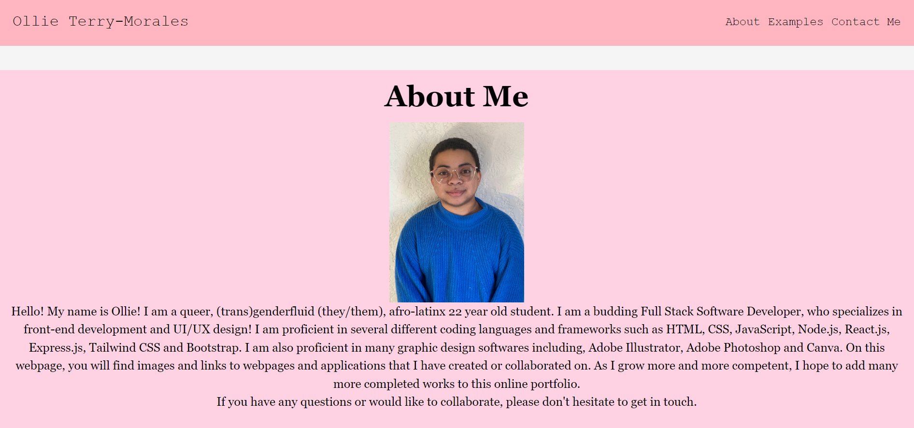

  
  # Pink React Portfolio

  ## Table of Contents
  * [Description](#description)
  * [Installation](#installation)
  * [Usage](#usage)
  * [Contributors](#contributors)
  * [Email](#email)
  * [Github](#github)
  * [License](#license)

  ## Description
  An updated portfolio based in React, showcasing examples of my work, a section about myself and a contact form page as well as other ways to contact me.

  

  ## Installation
  To view this portfolio, simply click the link provided in this ReadMe.
  [Deployed Application](https://otmorales23.github.io/pink-react-portfolio/)

  ## Usage
  To use this portfolio, open the link in a new tab. Then use the navigation bar to either read a blurb about me, see examples of my work with links to their GitHub repositories, or click the Contact Me section to send me a message.

  ## Contributors
  Ollie Terry-Morales, AskBCS Tutors

  ## Email
  If you have any questions please don't hesitate to reach out via email at oliverwills0227@gmail.com

  ## GitHub
  [See my GitHub Profile](https://github.com/otmorales23)

  
  ## License 
    This project is licensed with MIT

